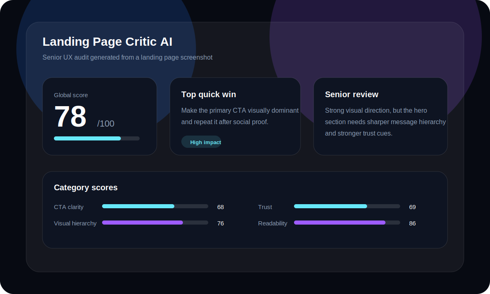

# Landing Page Critic AI

AI-powered UX audit tool for landing pages. Upload a screenshot or paste a URL and get a senior-style UX review with scores, insights, quick wins and conversion recommendations.



## What it analyzes

- UX problems
- Visual hierarchy
- CTA clarity
- Conversion opportunities
- Accessibility
- Cognitive load
- Trust signals
- Visual consistency
- Hero structure
- Spacing
- Readability

## Tech stack

### Frontend

- Next.js
- TypeScript
- Tailwind CSS
- Framer Motion
- Recharts
- Lucide React

### Backend

- Python
- FastAPI
- OpenAI Vision
- Playwright URL screenshots

## Project structure

```txt
landing-page-critic-ai/
├─ frontend/
│  ├─ app/
│  ├─ components/
│  ├─ lib/
│  └─ package.json
├─ backend/
│  ├─ app/
│  ├─ requirements.txt
│  └─ render.yaml
├─ docs/
│  └─ demo-dashboard.svg
├─ .env.example
└─ README.md
```

## Local setup

### 1. Backend

```bash
cd backend
python3 -m venv .venv
source .venv/bin/activate
pip install -r requirements.txt
playwright install chromium
cp ../.env.example .env
uvicorn app.main:app --reload --port 8000
```

### 2. Frontend

```bash
cd frontend
npm install
cp ../.env.example .env.local
npm run dev
```

Open `http://localhost:3000`.

## Environment variables

```env
OPENAI_API_KEY=your_openai_api_key_here
OPENAI_MODEL=gpt-4.1-mini
NEXT_PUBLIC_API_URL=http://localhost:8000
```

## API endpoints

### Analyze screenshot

```http
POST /analyze/image
Content-Type: multipart/form-data
file: image
```

### Analyze URL

```http
POST /analyze/url
Content-Type: multipart/form-data
url: https://example.com
```

### Demo response

```json
{
  "global_score": 78,
  "summary": "Strong visual direction, but the CTA hierarchy and trust proof need improvement.",
  "scores": {
    "ux": 82,
    "visual_hierarchy": 76,
    "cta_clarity": 68,
    "conversion": 74,
    "accessibility": 80,
    "cognitive_load": 72,
    "trust": 69,
    "consistency": 84,
    "hero_structure": 79,
    "spacing": 81,
    "readability": 86
  }
}
```

## Deployment

### Frontend on Vercel

- Root directory: `frontend`
- Build command: `npm run build`
- Output: `.next`
- Env: `NEXT_PUBLIC_API_URL=https://your-backend.onrender.com`

### Backend on Render

- Root directory: `backend`
- Build command: `pip install -r requirements.txt && playwright install chromium`
- Start command: `uvicorn app.main:app --host 0.0.0.0 --port $PORT`
- Env: `OPENAI_API_KEY`

## Product positioning

Landing Page Critic AI is designed like a real SaaS product: fast input, visual scoring, senior-level UX critique and clear next actions.

## Roadmap

- Add PDF export
- Add shareable audit links
- Add before/after recommendations
- Add design annotations over screenshots
- Add auth and saved projects
- Add competitive landing benchmark mode

## License

MIT
